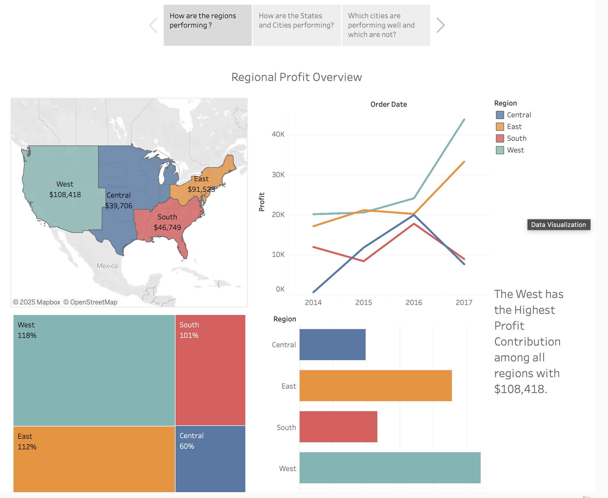

# 📊 Interactive Sales & Profit Dashboard | Tableau

**Author:** Aryan Shah  
📍 Georgia, USA | ✉️ aryanshahh15@gmail.com | 📞 (209) 395-6241  
🔗 [LinkedIn](https://linkedin.com/in/aryan-shah1010)  
🌐 [Live Tableau Dashboard](https://public.tableau.com/shared/ZGFN3K3FC?:display_count=n&:origin=viz_share_link)

---

## 🧠 Project Overview
This project presents an **interactive Tableau dashboard** built using the **Superstore dataset**.  
It visualizes **sales and profit performance** by region, product category, and customer segment to help businesses identify profitability drivers and growth opportunities.  

The goal is to showcase how clear data visualization supports data-driven decision-making.

---

## 🖼️ Dashboard Preview

> *Interactive Tableau dashboard displaying sales and profit trends across regions, categories, and customer segments.*

---

## 📈 Key Insights
- **West region** recorded the highest profit margins.  
- **Furniture category** had strong sales but low profits, signaling cost challenges.  
- **Corporate segment** generated the highest average order value.  
- **Sales peaked in Q4**, indicating strong seasonal demand.

---

## 🧩 Files in This Repository
| File | Description |
|------|--------------|
| `README.md` | Project documentation and dashboard summary |
| `dashboard_preview.png` | Screenshot of the Tableau dashboard |
| `sample_data.xlsx` | Sample data used for the visualization |
| `dashboard.twbx` | Tableau workbook file (if included) |

---

## 🚀 How to Explore
1. Click the **Tableau Dashboard link** above to open the live dashboard.  
2. Use interactive filters to explore sales and profit by category, region, and segment.  
3. Review key findings and insights from the visuals.

---

## 🛠️ Tools & Skills Used
- **Tableau:** Dashboard creation, calculated fields, map visualizations, storytelling.  
- **Excel:** Data cleaning and preparation before importing to Tableau.  
- **Data Visualization:** Communicating insights with charts, filters, and KPIs.  

---

## 💡 Future Improvements
- Add **forecasting charts** for sales trends.  
- Include **regional KPIs** with dynamic tooltips.  
- Integrate live connections for real-time updates.

---

## 📬 Contact
**Aryan Shah**  
📧 aryanshahh15@gmail.com 
📞 (209) 395-6241  
🔗 [LinkedIn](https://linkedin.com/in/aryan-shah1010)
